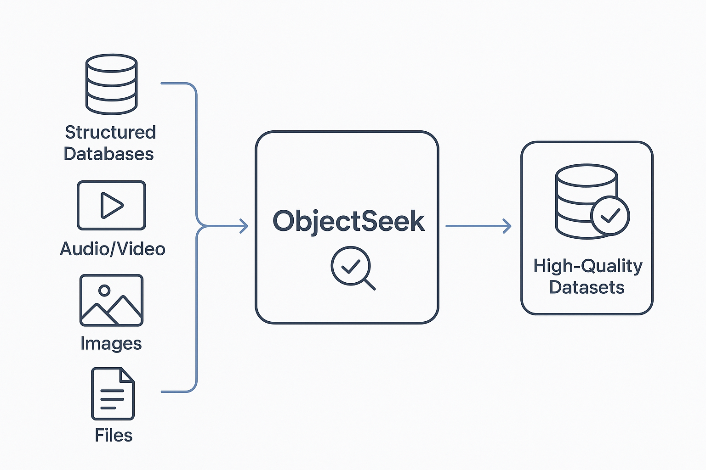

## ObjectSeek

我打算做一个 **AI 数据中台**，配合 [auto_ml](https://github.com/AI-change-the-world/auto_ml)，把 **AI 的全生命周期** 串起来：从数据采集、处理，到模型训练、上线，再到后续的优化迭代，都能在一个平台里搞定。

### 想做的事
- 搞一个统一的数据和模型管理平台  
- 让数据采集、处理、建模、部署一条龙  
- 模型上线之后还能持续优化，不用每次都重头来过  

### 先从哪儿开始
第一步我想先从 **视频/视频流** 入手，重点放在：
- **目标追踪**：在视频里实时追踪人或物体  
- **关键要素发现**：找到视频里真正有价值的信息  

### 后面要走的方向
等这块跑通了，会继续扩展到：
- 支持更多模态的数据（图像、语音、文本等等）  
- 自动做特征工程和模型选择  
- 训练、评估、部署一步到位（MLOps 风格）  
- 加上可视化和监控，帮忙做更聪明的决策  

---
总之，目标就是：让 **AI 从数据到落地** 这条链路变得更顺畅，能真的跑起来，而不只是停留在实验室。

### 技术栈

* python
* react（我喜欢用flutter，但是flutter接入一些视频流好像不太成熟，就开始自学react了）

### 有趣的事情：用豆包让图像动起来...

<video src="./resources/video.mp4" controls width="600" loop>
  你的浏览器不支持 video 标签。
</video>